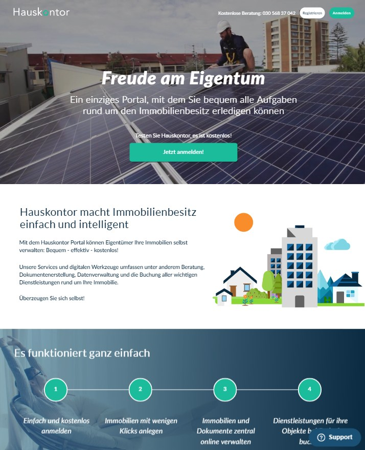

# Hauskontor 
Live url: https://www.hauskontor.de/ 

## Project Description
Hauskontor is a modern web site built on WordPress. It consists of a set of landing pages linked together. One of the customer's requirements was to make all pages pixel perfect to their Photoshop templates. Design was provided.

Hauskontor frontend was written using Pug (Jade) template engine and SCSS styling language. Once translated into pure PHP code and CSS rules source files are ready to use with WordPress. Frontend building is automated with Gulp building system. WordPress CMS provides useful admin panel for content management. All key landing sections are editable from admin panel through Advanced Custom Fields plugin. Like all WordPress sites Hauskontor uses MySQL database management system for storing data.

## Technologies:
* PHP
* MySQL 
* WordPress
* Advanced Custom Fields
* HTML, CSS, JavaScript
* Gulp.js: 
    * Jade
    * Scss

## Preview

